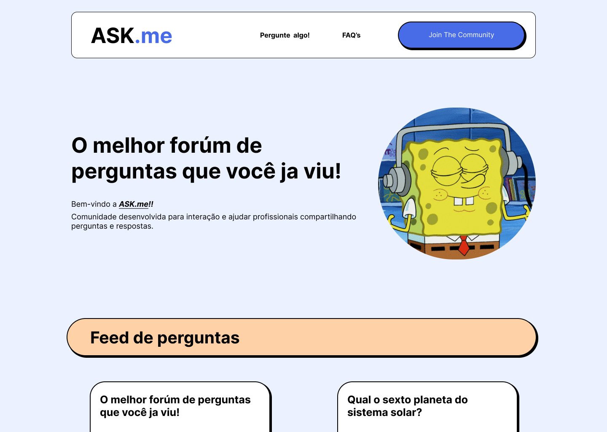

# Ask.me🤔

> Comunidade de perguntas e respostas, criando interações aos usuários de forma anônima e de temas livres (dado o supervisionamento da administração).

### Sobre o projeto

A principal premissa do projeto foi desenvolver uma comunidade/fórum de interação, onde ocorrem de forma anônima sem a necessidade efetuar logins ou registros. Presando sempre o respeito mútuo dentro da rede.

Acesse o link abaixo para previsualizãção em video do projeto.:
<a href="https://www.linkedin.com/feed/update/urn:li:activity:7006646867572715520/" target="_blank">Ver video 👀</a>

Ou acesse o projeto direto.:
<a href="http://157.230.84.252/" target="_blank">Interagir com o projeto 👨‍💻</a>

### Roadmap

- 📚Interatividade em massa entre os usuários da aplicação.
- 🖥️Desenvolver resolução de problemas e dúvidas (feed de perguntas)

### Referências

Foram utilizados os seguintes sites como referência de desenvolvimento da comunidade.:

- Yahoo respostas.
- Ask.Fm.
- Fóruns de interação de modo geral.

### Tecnologias utilizadas

